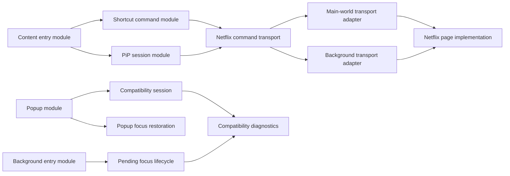
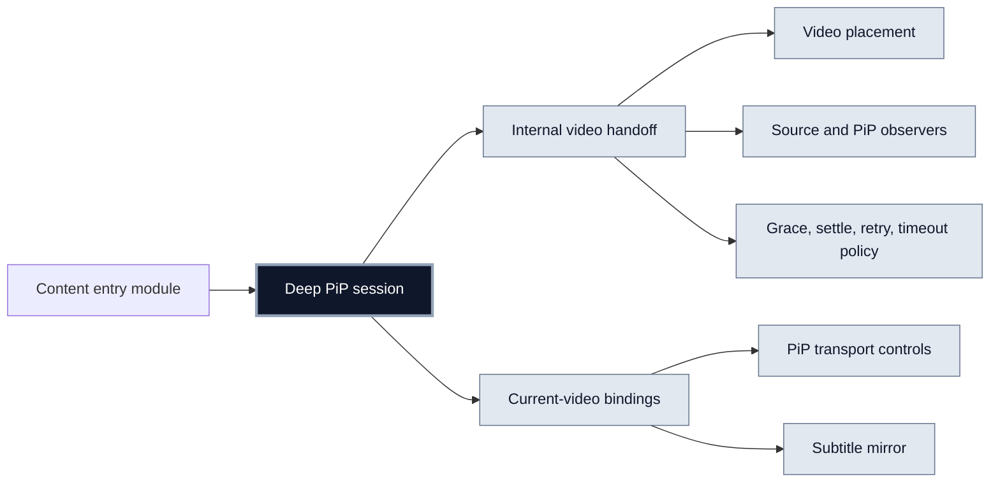
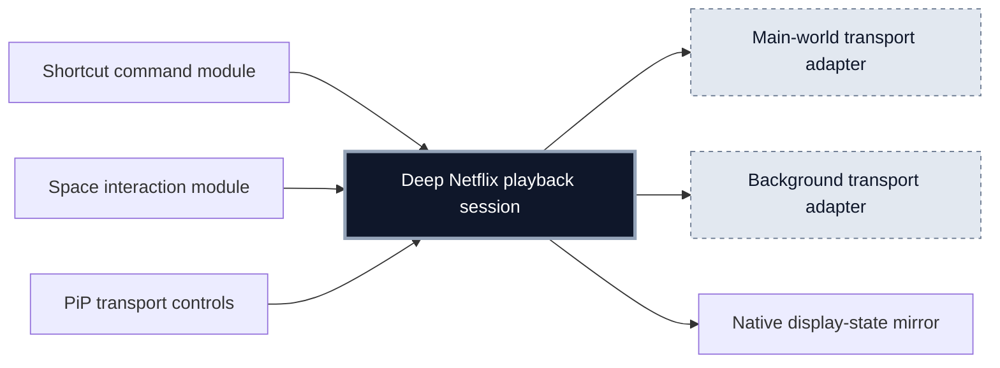
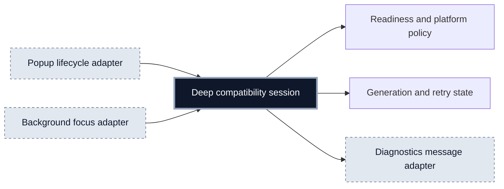
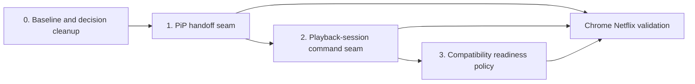

# Architecture plan — Netflix Shortcut Override

Status: Proposed  
Date: 2026-07-22  
Scope: the current working tree, with extra weight on the recent PiP, compatibility-session, and playback-focus changes.

## Decision summary

The codebase should be deepened in three stages:

1. **Concentrate PiP video handoff state** — Strong; first priority.
2. **Make the Netflix playback session the one command seam** — Strong; second priority.
3. **Give compatibility readiness one owner** — Worth exploring; third priority.

The first stage is the immediate architecture target because the current PiP implementation has recently gained the most stateful behavior. It can be improved behind the existing `PipManager` interface without changing callers or reopening the agreed Document PiP surface.

The plan deliberately prefers existing seams. A new seam is justified only when it hides real variation or concentrates complexity that would otherwise spread across callers. The deletion test is the gate: if deleting a module merely moves complexity elsewhere, it should not be extracted.

## Current architecture

### Architectural observations

- `PipManager` has a small external interface and a large implementation. It is already a deep module, but its implementation now contains two stateful concerns: PiP lifecycle and Netflix video handoff.
- The PiP session, PiP transport controls, subtitle mirror, and video placement are correctly related to the `PiP session` domain concept. The risk is not their existence; it is the handoff policy leaking into the session lifecycle implementation.
- The Netflix command transport already has two adapters: a main-world event path and a background scripting path. That is a real seam. The remaining friction is that callers and the page implementation still share responsibility for native media mirroring and failure interpretation.
- The popup compatibility session and background playback-focus lifecycle both request diagnostics and interpret readiness. The shared readiness predicate checks fields but does not own the full retry, platform, and enabled-state policy.
- The recent popup compatibility deepening and playback-focus work have good test coverage. The plan should preserve that locality instead of replacing tested seams with lower-level test doubles.

## Design principles

### One highest useful seam

Callers and tests should cross the same interface. The highest existing seam is preferred even when the implementation is internally composed of smaller modules.

- PiP behavior: the existing `PipManager` interface.
- Playback commands: the existing command transport seam, deepened rather than duplicated.
- Compatibility readiness: the existing compatibility-session and background lifecycle entry points, backed by one shared policy implementation.

### Depth over extraction

The goal is not smaller files. The goal is more leverage per fact a caller must learn:

- One PiP session interface should hide placement, binding, handoff, cleanup, and timeout behavior.
- One playback-session interface should hide transport choice, source-of-truth rules, and result normalization.
- One readiness policy should hide generation, retry, and platform interpretation from popup and background adapters.

### Adapters only where variation is real

The two Netflix command transports justify a seam because they already vary in production. PiP handoff observers and browser timers should remain implementation details unless a second concrete adapter is needed. Tests should use the existing constructor seams and fake browser environment rather than exporting private modules for convenience.

## Workstream 1 — PiP video handoff

### Goal

Keep one Document PiP window attached to the current Netflix playback experience while Netflix reuses or replaces its video element during an episode transition.

### Target shape

### Seam

Keep `PipManager` as the external seam. `enter`, `toggle`, `exit`, `destroy`, active-state queries, and PiP-document queries remain the only knowledge the content entry module needs.

The video-handoff implementation becomes an internal seam of the PiP session. It is not exported just to make tests easier. The PiP session remains responsible for deciding when the handoff implementation is active and for applying its result to placement and bindings.

### Responsibilities behind the internal seam

- Observe the Netflix player root and the PiP video area.
- Observe lifecycle signals from the adopted video: `ended`, `emptied`, `error`, `loadedmetadata`, and `playing`.
- Wait briefly for Netflix DOM settling before choosing a candidate.
- Prefer a newly created video inside the current Netflix player root.
- Re-adopt the same video when Netflix has moved it back to the source document.
- Ignore unrelated source videos while the current PiP video is still attached and healthy.
- Rebind video placement, PiP transport controls, subtitle mirroring, and media listeners after adoption.
- Suppress PiP video clicks during replacement grace so an obsolete playback session cannot be restarted.
- Close the PiP session when recovery exceeds the deadline or repeated adoption attempts fail.
- Remember the last valid intrinsic dimensions until replacement metadata becomes available.

### Invariants

- The PiP window remains the same window during handoff.
- There is only one Netflix playback session.
- The native video element is read for display state but is not a second source of truth for playback position.
- A late event from an old video cannot modify the current PiP bindings.
- Cleanup is idempotent and restores the currently adopted video to its source placement.

### Test seam and exit criteria

Tests drive the existing `PipManager` seam and observe the PiP document, source document, adopted video, controls, subtitles, click handling, and cleanup. They do not call private handoff functions or assert timer fields.

The workstream is complete when the test suite covers:

- replacement video adoption;
- same-element episode reuse;
- replacement after temporary reattachment;
- stale player roots and unrelated videos;
- grace-period click suppression and recovery;
- remembered aspect ratio before `loadedmetadata`;
- deadline and repeated-attempt closure;
- explicit exit, `destroy`, browser `pagehide`, and late-event cleanup.

Real Chrome Netflix validation remains a separate acceptance gate. Automated tests must not claim to prove production Netflix player-session ordering.

## Workstream 2 — Netflix playback-session command seam

### Goal

Make the `Netflix playback session` the place where command intent, transport choice, native mirroring, and failure interpretation are concentrated.

### Current friction

Shortcut commands and Space-hold logic call the command transport while also mutating native media state. PiP transport controls call the same transport for absolute seeks. The page implementation then performs another round of native state mirroring. This spreads source-of-truth rules across callers, transport adapters, and the page implementation.

### Target shape

### Planned decisions

- Deepen the existing command transport seam instead of introducing a second command module.
- Keep the two existing transport adapters replaceable behind that seam.
- Make the Netflix playback session the owner of command routing and response normalization.
- Keep native media reads and display mirroring subordinate to Netflix playback-session state.
- Keep user feedback, such as shortcut hints, in the caller unless it is part of command failure semantics.
- Preserve the no-native-seek fallback rule.
- Preserve absolute seeks from PiP and relative seeks from keyboard shortcuts as distinct command intents targeting the same playback session.

### Test seam and exit criteria

Existing command-controller, Space-interaction, PiP-controls, transport, and bridge tests should continue to observe external behavior. The desired leverage is one command path exercised by many callers, not a new set of lower-level mocks.

The workstream is complete when a command’s transport, mirroring, and failure semantics can change in one implementation without editing every caller, and when tests prove that PiP, keyboard shortcuts, and Space hold all target the same playback-session rules.

## Workstream 3 — Compatibility readiness policy

### Goal

Give the `Compatibility session` concept one owner for readiness, generation, retry, and platform policy so popup and background behavior cannot drift.

### Current friction

The popup compatibility session contains initial receiver retries, open diagnostics polling, loading generations, settled state, and page-context changes. The background playback-focus lifecycle separately requests diagnostics, waits for readiness, retries, and applies Firefox-specific bridge requirements. The shared readiness predicate checks the diagnostic fields but does not own the complete policy.

### Target shape

### Planned decisions

- Keep React lifecycle concerns in the popup adapter and service-worker lifecycle concerns in the background adapter.
- Centralize readiness policy, including `enabled`, browser-specific bridge requirements, missing-receiver retry, and stale-response suppression.
- Preserve the existing `Compatibility session` language from `CONTEXT.md`; do not rename it to a generic diagnostics concept.
- Prefer one reusable policy implementation over a shared live state, because popup and background run in different browser contexts.
- Keep playback focus restoration as its own domain concept. It consumes compatibility readiness; it does not become part of the compatibility session’s public interface.

### Test seam and exit criteria

The popup hook and background focus lifecycle remain the highest observable seams. Their tests should verify that both use the same readiness outcomes for loading generations, Firefox bridge requirements, receiver recovery, stale responses, and cancellation.

The workstream is complete when a readiness-policy change requires one implementation change and both popup and background tests continue to express the user-visible behavior through their existing seams.

## Sequencing

### Phase 0 — Baseline

- Keep the current working tree’s user changes intact.
- Run the existing targeted PiP, Netflix bridge, compatibility-session, and playback-focus tests before each workstream.
- Treat `CONTEXT.md` and the completed telemetry research as the domain source of truth.
- Reconcile the documented PiP sizing decision before merging unrelated PiP changes: current `CONTEXT.md` describes a preferred 640 CSS-pixel width, while the earlier closed sizing task records browser-chosen initial sizing. This is a product decision, not part of the handoff seam.

### Phase 1 — PiP handoff

Start here. It has the strongest locality signal, the most recent implementation churn, and the clearest existing test seam. Finish the internal handoff seam and its lifecycle tests before changing playback command routing.

### Phase 2 — Playback session

Do this after PiP handoff behavior is stable. PiP controls are one of the callers that will benefit from the deeper command seam, and stabilizing handoff first avoids mixing DOM replacement races with transport changes.

### Phase 3 — Compatibility readiness

Do this after the playback work unless a platform bug makes readiness drift urgent. It is valuable for locality, but the recent popup deepening already provides a strong external seam and broad regression coverage.

## Cross-workstream constraints

- Do not add a module whose interface merely repeats its implementation. Apply the deletion test before extracting anything.
- Do not test past a module’s interface to reach private timers, observers, or browser calls.
- Do not introduce a seam for one hypothetical adapter. The Netflix command transports are already two real adapters; PiP handoff remains internal until a second concrete implementation exists.
- Do not widen the PiP session interface to expose handoff state. Callers need an active PiP session, not its internal recovery policy.
- Keep domain names from `CONTEXT.md`: `PiP session`, `PiP timeline`, `PiP transport controls`, `Netflix playback session`, `Compatibility session`, and `Playback focus restoration`.
- Keep real-browser validation separate from automated tests. Browser and Netflix behavior can invalidate assumptions that a deterministic test environment cannot prove.

## Risks and mitigations

| Risk | Why it matters | Mitigation |
| --- | --- | --- |
| Netflix changes its player DOM | Candidate selection may adopt the wrong video or miss a handoff | Keep selection behind the PiP handoff seam; add real-Chrome checks to the existing validation task |
| Late media or observer events | Old bindings can update the current PiP surface | Make binding generations and cleanup observable through the `PipManager` seam |
| Native media diverges from the Netflix playback session | The PiP timeline could display or command stale state | Keep native media read-only for display and route writes through the Netflix playback session |
| Popup and background lifecycles differ | A shared live coordinator would be unreliable across browser contexts | Share policy implementation, not runtime state; retain popup and background adapters |
| PiP scope expands again | More controls would increase the session interface and reduce depth | Keep the current timeline-only surface and browser-owned frame decisions out of this plan |

## Definition of architectural success

The plan is successful when:

- PiP callers know only the PiP session interface, not handoff policy.
- Playback callers know only the Netflix playback-session command interface, not transport or mirroring details.
- Popup and background callers consume one compatibility-readiness policy without sharing browser-context state.
- Each deep module has one highest useful seam and tests cross that seam.
- Changes, bugs, domain knowledge, and verification have better locality than they do in the current working tree.
- The number of seams stays small while the leverage of each interface increases.
